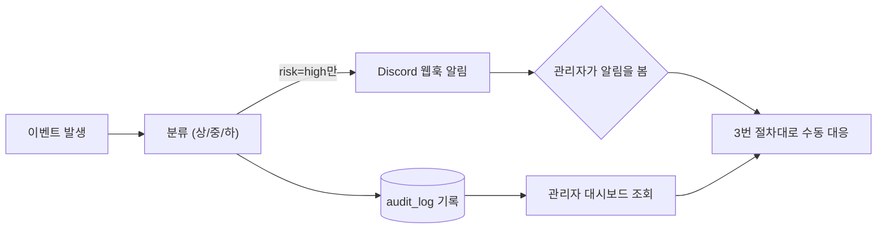

# 탐지 → 대응 절차 (Detection & Response)

작성일: 2026-09-14

> **이 문서가 채우는 공백**: 탐지(분류·기록·알림)는 이미 구현돼 있지만, "탐지된 뒤 사람이 실제로 뭘 하는가"에 대한 절차는 어디에도 문서화된 적이 없었다(접근 차단 방식 자체도 아직 미결정으로 남아있는 것도 같은 공백). 이 문서는 (1) 지금 실제로 동작하는 탐지→알림 흐름을 한 곳에 정리하고, (2) 그 다음 단계인 "사람의 대응"을 절차로 못 박고, (3) 필수/추가 구현을 구분하고, (4) 시연 시나리오를 제공한다.

> **[2026-09-16 갱신]** 2026-09-15 사이 이 문서 범위(`audit_log` 기반 탐지→기록→알림→조회) 안에서 실제로 있었던 변경 4건을 반영했다 — (1) 감사 로그 대시보드에 "위험 탐지만/일반 활동만" 필터 추가(2번·2-1·3번 섹션), (2) 감사로그 해시체인에 락이 없어 동시 요청 시 위변조 탐지 자체가 깨질 수 있던 레이스 컨디션 수정, (3) `GET /audit-summary`가 `/chat`과 같은 이벤트 루프 블로킹 버그를 갖고 있어 조회 화면 자체가 다른 요청을 막던 문제 수정, (4) "트리거+장소조사" 조합 PII 오탐(5번 섹션의 "저는 X" 항목과 이어지는 후속 사례) 최종 해결 — 전부 5번 섹션에 상세 추가.

---

## 1. 전체 흐름

- **분류**: `was/risk-classification.js` / `chatbot-service/audit-agent/risk_classification.py` — action 기준 상/중/하
- **기록**: MySQL `audit_log`(WAS), `audit-logs/audit_log.jsonl`(챗봇), 둘 다 `risk_level` 평문 컬럼 포함
- **알림**: `risk_level === "high"`일 때만 Discord — WAS는 `was/audit.js:17`에서, 챗봇은 `chatbot-service/audit-agent/engine.py:61`에서 각각 독립적으로 게이트
- **조회**: `frontend/admin-audit-dashboard.html` — KPI 요약, Critical/High 표, PII 마스킹 발견 내역, 전체 이력(등급 필터+페이지네이션)

**이 문서의 범위**: 위 흐름(`audit_log` 기반 위험도 분류→기록→알림→조회)만 다룬다. 로그인(15분 5회)/OCR(분당 10회)/챗봇(분당 20회) rate limit은 이 흐름과 완전히 별개로 동작하는 자동 요청 제한 계층이다 — `audit_log`에 안 남고 Discord 알림도 안 가지만, 반복 요청 자체는 이미 자동으로 막고 있다. 즉 "자동 방어가 TOTP 하나뿐"이라는 아래 3번 설명은 이 `audit_log` 흐름 안에서만 유효하고, rate limit까지 포함하면 자동 방어가 이미 하나 더 있는 셈이다.

## 2. 필수 산출물 — 이미 구현·검증됨

| 항목 | 구현 위치 | 상태 |
|---|---|---|
| 로그인 이상탐지 (반복실패/고빈도/긴입력/관리자 신규위치/SQLi 패턴) | `was/routes/auth.js`, `was/totp-utils.js` | ✅ 16개 시나리오 PASS 검증 완료 (SQLi 패턴은 2026-09-14 추가, 별도 검증) |
| 챗봇 프롬프트 인젝션 탐지 | `chatbot-service/audit-agent/masking.py` `MALICIOUS_INTENT_DETECTED` | ✅ |
| PII/민감정보 마스킹 미탐지 스캔 | `chatbot-service/log_audit_tool.py` `scan_for_pii()` | ✅ 347건 스캔 실측 |
| 위험도 분류 (상/중/하 → Critical/High/Medium/Low) | `risk-classification.js`/`.py`, `audit-severity.js` | ✅ |
| 실시간 알림 | `discord-notify.js`, `audit_notify.py` | ✅ 두 서비스 각각 독립 구현, 5분 디바운스 |
| 탐지 현황 조회 화면 | `admin-audit-dashboard.html` | ✅ (2026-09-14 이력·마스킹 미리보기 추가로 완성, 2026-09-15 "위험 탐지만/일반 활동만" 필터 추가로 노이즈 제거 가능) |

**결론: "탐지"는 요구사항을 충족한다.** 아래부터가 실제 공백이다.

## 2-1. 분류 기준 상세 (왜 이 이벤트가 이 등급인가)

대응 절차(3번)를 읽기 전에 "애초에 왜 그 등급인지"가 있어야 판단이 선다.

**WAS — `was/risk-classification.js`**

| action | 등급 | 근거 |
|---|---|---|
| `login_anomaly_admin_repeated_failure` | 상 | 관리자 계정 대상 반복 실패 (5분 내 3회) |
| `login_anomaly_admin_new_ip` | 상 | 관리자 계정 신규 IP 로그인 성공 — 이미 로그인에 성공한 이벤트 |
| `login_anomaly_admin_new_location` | 상 | 관리자 계정 신규 지역 로그인 성공 |
| `totp_verify_fail` | 상 | 관리자 신규 위치 추가 인증 실패 — 비밀번호는 이미 통과했다는 의미 |
| `totp_disabled` | 상 | 2차 인증 자체를 제거하는 조작 |
| `login_anomaly_sqli_pattern` | 상 *(2026-09-14 추가)* | 아이디/비밀번호에 SQL 인젝션 패턴(`' OR '1'='1`, `UNION SELECT`, `;DROP` 등)이 그대로 들어옴 — 쿼리가 파라미터화돼 있어 실행은 안 되지만, 성공/실패와 무관하게 침해 시도 신호로 취급 |
| `login_anomaly_repeated_failure` | 중 | 일반 계정 반복 실패 (5분 내 5회) |
| `login_anomaly_high_frequency` | 중 | 동일 IP 1분 내 10회 시도(성공/실패 무관) |
| `login_anomaly_long_input` | 중 | 아이디/비밀번호 200자 초과 |
| `account_role_change` | 중 | 권한 상승 가능한 민감 조작 |
| `oversized_request_payload` | 중 *(2026-09-14 추가)* | 요청 본문이 100KB 초과 — `login_anomaly_long_input`(200자 기준)과 같은 성격의 신호지만 규모가 훨씬 큼 |
| `login_success`/`login_fail`/`totp_verify_success`/`totp_enrolled`/`patient_register` | 하 | 정상 흐름 |
| *(매핑 없음, 신규 action)* | **중** | 안전측 기본값 — 조용히 저위험 취급되는 것 방지 |

**챗봇 — `chatbot-service/audit-agent/risk_classification.py`**

| 조건 | 등급 | 근거 |
|---|---|---|
| `masking.py`가 `MALICIOUS_INTENT_DETECTED` 탐지 | **상** (action 무관 최우선 승격) | 조회성 호출이라도 프롬프트 인젝션이면 최우선 노출 |
| `book_appointment` | 중 | 상태를 변경하는 도구 호출 |
| `check_scanned_documents`/`check_appointments`/`check_medical_records`/`rag`/`direct_answer` | 하 | 조회성 도구 호출 |
| *(매핑 없음)* | **중** | WAS와 동일한 안전측 기본값 |

**정확한 임계값**(코드 대조 확인, `was/routes/auth.js`/`totp-utils.js`):
- 일반 계정 반복 실패: 5분 내 5회, 관리자는 3회
- 동일 IP 고빈도: 1분 내 10회
- 긴 입력값: 200자 초과 (감사 로그엔 길이만 기록, 입력값 원문은 안 남김)
- 계정 기준(반복실패)과 IP 기준(빈도)은 독립 집계
- TOTP 추가 인증은 **TOTP를 등록한 관리자에게만** 적용 — 미등록 관리자는 기록만 되고 로그인은 그대로 허용

**[2026-09-15 추가] risk_level과는 별개인 "카테고리" 축**: 위 표의 하(low) 등급 안에는 `login_success`처럼 완전히 정상적인 활동과, 아직 이상탐지 임계값에 안 걸렸을 뿐인 이벤트가 섞여 있다 — 실제로 운영해보니 로그인 성공/실패가 반복 기록되면서 진짜 봐야 할 이상탐지 이벤트가 화면에서 묻히는 문제가 나타났다(대시보드 "감사 로그 전체 이력"이 사실상 로그인 기록만 끝없이 보여주는 상태). 그래서 risk_level 등급과는 독립적으로, "이상탐지 로직이 만든 이벤트인가"만 판단하는 카테고리를 추가했다 — `was/risk-classification.js`의 `ANOMALY_ACTIONS` 목록(=`login_anomaly_*` 6종 + `totp_verify_fail` + `totp_disabled` + `oversized_request_payload`)에 있으면 `anomaly`, 없으면(로그인 성공/실패, TOTP 등록/인증 성공, 계정 등록, 역할 변경 등) `routine`. `GET /api/audit-log?category=anomaly`로 필터링 가능(3번 절차의 1단계 참고).

**"Critical" 등급의 정체**: DB에는 상/중/하 3단계만 저장된다(`ENUM('low','medium','high')`). "Critical"은 별도로 저장되는 값이 아니라, `risk_level='high'`인 이벤트 중 "이미 로그인에 성공했거나 표적이 된 관리자 계정 침해 정황"(신규 IP/신규 지역/반복 실패 3종)만 조회·알림 시점에 한 단계 더 올려서 보여주는 표시용 라벨이다. 이 구분(어떤 high가 Critical로 승격되는지)이 대시보드 코드와 Discord 알림 코드에 각각 따로 하드코딩되어 있어서 — 지금은 서로 일치하지만, 둘 중 하나만 고치면 등급이 어긋날 수 있는 구조적 약점으로 남아있다(우선순위 낮음, 수정 안 하기로 결정).

## 2-2. 권한 — 누가 이 절차를 실행할 수 있는가

이 프로젝트의 권한(RBAC) 체계 기준:

| 권한 | 부여 대상 | 이 문서에서의 역할 |
|---|---|---|
| `audit:view` | admin만 | 감사 로그 대시보드/전체 이력 조회(3-1단계) — `GET /api/audit-log`, `GET /api/audit-log/summary` 게이트 |
| `accounts:manage` | admin만 | 계정 역할 변경(3-3단계) — `PATCH /api/accounts/:id/role` 게이트 |
| `patients:register` | staff, admin | 참고: 계정 신규 등록만 가능, role 변경은 못 함(`accounts:manage`와 의도적으로 분리) |

즉 **이 문서의 대응 절차 전체를 실행할 수 있는 사람은 현재 admin 역할뿐**이다 — staff에게 위임된 대응 권한은 없음(설계상 의도).

## 3. 탐지 이후 — 수동 대응 절차 (신규 문서화)

관리자가 Discord 알림을 받거나 대시보드에서 Critical/High를 확인했을 때 실행하는 절차. **자동 방어는 "TOTP 등록 관리자의 신규 위치 로그인" 단 한 가지뿐이고(2번 참고), 나머지는 전부 사람이 직접 확인·조치해야 한다** — 이 사실 자체를 인지하고 절차에 반영하는 게 핵심이다.

1. **확인**: `admin-audit-dashboard.html`의 "감사 로그 전체 이력"에서 `risk=high` 필터로 해당 이벤트의 계정(`actor_username`)·IP(`detail`)·시각을 특정한다. 로그인 성공/실패 기록이 많이 쌓여 있으면 등급 필터와 별개로 "위험 탐지만"(`category=anomaly`) 필터를 같이 켜서 정상 로그인 기록을 먼저 걷어내는 게 빠르다(2-1 참고). 대시보드 없이 DB에서 직접 볼 때는 `SELECT * FROM audit_log WHERE action LIKE 'login_anomaly%';`로 조회 가능. 각 action의 `detail` JSON에 실제로 뭐가 들어있는지는 아래 표 참고:

   | action | detail 예시 |
   |---|---|
   | `login_anomaly_repeated_failure` | `{ username, ip, count: 5, threshold: 5 }` |
   | `login_anomaly_high_frequency` | `{ ip, count: 10 }` |
   | `login_anomaly_long_input` | `{ ip, usernameLength, passwordLength, maxAllowed: 200 }` |
   | `login_anomaly_admin_repeated_failure` | `{ username, ip, count: 3, threshold: 3 }` |
   | `login_anomaly_admin_new_ip` | `{ username, ip, knownIpCount }` |
   | `login_anomaly_admin_new_location` | `{ username, ip, region, knownRegionCount }` |
   | `totp_verify_fail` | `{ username, ip }` |
2. **오탐/실제 위협 판단**:
   - `login_anomaly_admin_new_ip`/`new_location` → 해당 관리자에게 실제 본인의 접속인지 직접 확인(전화/사내 메신저 등 대역 외 채널). **자동 1차 방어(유일한 예외)**: TOTP(Time-based One-Time Password — 30초마다 바뀌는 6자리 인증 앱 코드, 관리자가 Google Authenticator 등에 미리 등록)를 등록해둔 관리자가 처음 보는 IP/지역에서 로그인을 시도하면, WAS가 비밀번호 통과 직후 곧바로 6자리 코드 입력을 추가로 요구한다(`was/routes/auth.js`). 코드를 맞히지 못하면 로그인 자체가 거부되고 `totp_verify_fail`이 남는다 — 즉 이 한 가지 케이스만은 사람이 대응하기 전에 시스템이 이미 자동으로 1차 방어를 하고 있다(그 인증까지 통과했다면 더 심각하게 취급할 것). TOTP를 등록 안 한 관리자는 이 방어가 아예 없고 기록만 남는다.
   - `totp_verify_fail` 반복 → 비밀번호까지는 뚫렸다는 의미(TOTP 단계까지 도달했으므로) — 즉시 해당 계정 조사.
   - 챗봇 `MALICIOUS_INTENT_DETECTED`(=대화 내용에서 프롬프트 인젝션 의심 키워드가 걸린 상태) → `event_id`로 `chatbot-service/log_audit_tool.py`를 이용해 해당 대화 전체를 복호화·조회, 실제 인젝션 시도인지 단순 오탐(예: 보안 관련 질문)인지 판단.
   - `login_anomaly_sqli_pattern` → 다른 로그인 이상탐지와 달리 `detail`에 **입력값 원문이 마스킹 없이 그대로** 남아있다(`payloadSample`, 최대 200자) — 다른 것처럼 대역 외 확인이 필요 없고, 이 값만 보면 바로 판단 가능. 쿼리는 파라미터화돼 있어 이 시도 자체로 뚫리진 않지만, 같은 IP에서 반복되면 자동화 공격 도구를 의심할 것. (**2026-09-14 수정 완료**: 처음 추가됐을 땐 Discord `EVENT_LABELS`에 라벨이 없어서 "미분류 위험 이벤트"로만 떴는데, 전용 라벨("SQL 인젝션 시도 탐지")을 추가해서 지금은 바로 식별 가능 — 6번 섹션 시연 캡처에서 실제 적용된 것 확인됨.)
3. **조치 (현재 앱 안에서 가능한 것)**:
   - 계정 권한이 문제라면 `PATCH /api/accounts/:id/role`(`was/routes/accounts.js:45`, admin-accounts.html)로 역할 변경 가능.
   - 그 외에는 **DB 직접 개입이 유일한 수단**이다 — 예: 비밀번호 해시를 직접 초기화하거나, TOTP 재등록을 강제로 요구.
4. **조치 (현재 앱에 기능 자체가 없음 — 정직하게 기록)**:
   - 계정 잠금/비활성화 버튼 없음 (accounts.js에 role 변경 외 엔드포인트 없음)
   - 세션 강제 무효화(로그아웃) 기능 없음
   - IP 차단/블랙리스트 없음 — 이미 있는 신호(`MALICIOUS_INTENT_DETECTED` 플래그, 로그에 기록만 되고 조치 없음)를 활용할 수는 있지만, 아래 질문들이 전부 미정이라 구현이 안 됨:
     - 차단 기준이 IP인가 계정인가(비로그인 상태 악의적 접근은 IP 기준 아니면 못 막음 — 아마 둘 다 필요)
     - 저장 위치: 새 DB 테이블(영구) vs 메모리(재시작 시 풀림, 지금 rate limit과 같은 방식)
     - 자동 차단 vs 관리자 승인(`MALICIOUS_INTENT_DETECTED` 뜨자마자 자동 차단은 오탐 위험 있음)
     - 해제 정책: 영구 차단 vs 일정 기간 후 자동 해제
     - 차단 메시지: 너무 구체적이면 우회 방법을 알려주는 셈이라 "일시적으로 이용이 제한되었습니다" 수준으로 뭉뚱그릴지
   - 위 다 없다는 전제 하에, 지금 유일한 실질적 조치는 **비밀번호/TOTP를 관리자가 DB에서 직접 재설정**하는 것뿐이다.

## 4. 필수 vs 추가 구현 정리

| 구분 | 항목 | 상태 | 비고 |
|---|---|---|---|
| 필수 · 완료 | 탐지/분류/기록/알림/조회 (2번 표 전체) | ✅ | |
| 필수 · 이 문서로 충족 | "탐지 시 대응 절차" 문서화 | ✅ | 3번 섹션 — 코드 구현이 아니라 절차 정의로 요구사항 충족 |
| 추가(선택) | 계정 잠금/강제 로그아웃 API + admin-accounts.html 버튼 | ❌ 미구현 | 있으면 3-4번 공백이 실제로 메워짐 — 시간 되면 가장 우선순위 높은 추가 구현 |
| 추가(선택) | IP/계정 블랙리스트 | ❌ 미구현 | 설계 질문만 정리돼 있고 결정은 안 됨 |
| 추가(선택) | 알림 채널 다변화(이메일/문자) | ❌ 미구현 | 지금은 Discord 단일 채널 |
| 추가(선택) | 재시작 생존 카운터(Redis 등) | ❌ 미구현 | 지금은 실패 횟수·신규 IP/지역 목록이 서버 메모리에만 있어서, 서버를 재시작하면 전부 초기화됨 — 재시작 직후엔 관리자가 이미 쓰던 IP로 로그인해도 "신규 IP"로 한 번 오탐될 수 있고, 반대로 누적되던 반복실패 카운트도 같이 사라짐 |
| 추가(선택) | 관리자 신규 위치 탐지의 User-Agent/VPN 판별 | ❌ 미구현 | 지금은 IP/지역(IP 기반 추정)만 "신규 위치"로 보고 TOTP 재인증을 거는데, 같은 IP·지역에서 다른 기기/브라우저로 접근하는 경우나 VPN으로 지역을 위장하는 경우는 못 잡음 |
| 추가(선택) | OCR 스캔 문서 사후 PII 감사 | ❌ 미구현 | 대화 로그(`chatbot_sqlite`/`mysql_chat`)는 마스킹이 빠진 게 있는지 나중에 훑어보는 도구(`scan_for_pii`)가 있는데, OCR로 스캔해 DB에 저장한 문서(`scanned_documents` 테이블)는 리더 자체가 없어서 같은 사후 점검을 못 받음 — 업로드 시점 실시간 마스킹만 있고, 그게 빠졌는지 나중에 확인할 방법이 대화 로그 쪽과 비대칭 |

## 5. 과거 탐지→개선 이력 (이 루프가 실제로 작동했다는 증거)

"탐지→대응"이 문서상 절차만은 아니라는 근거로, 탐지 도구가 실제로 문제를 찾아내고 그게 코드 수정으로 이어진 사례들:

| 발견 | 원인 | 조치 | 검증 |
|---|---|---|---|
| RRN/전화번호가 `.`(점)으로 구분되면 마스킹 우회 | `pii_masking.py` 구분자 문자 클래스에 `.` 누락 | `SEPARATOR` 상수로 통합, 6곳 재사용 | 기존 테스트 8개 전부 통과 + 점 구분 케이스 정상화 |
| 같은 마스킹 우회가 `was/crypto-utils.js`엔 미반영 | Python 쪽만 고치고 JS 쪽은 동기화 안 됨("규칙은 같이 업데이트" 주석이 있었는데도) | `SSN_PATTERN`/`PHONE_PATTERN` 구분자 대응 추가 | — |
| 011/016/017/018/019 구형 3자리 국번 전화번호 마스킹 안 됨 | 중간 구간이 4자리 고정 | `(?:4자리|3자리)` 대체로 변경 | 회귀 테스트 추가, 통과 |
| chatbot-service `/chat`에 서비스 간 인증 없음 — `patient_id`를 요청 body 그대로 신뢰해서, 값만 바꾸면 남의 예약·진료기록 존재 여부를 조회 가능했음(IDOR = Insecure Direct Object Reference, "권한 확인 없이 ID만 바꿔서 남의 데이터에 접근" 유형의 취약점) | WAS-챗봇 사이 공유 시크릿 검증 전무 | 양쪽 서비스에 같은 `CHATBOT_SERVICE_KEY`를 두고, 요청마다 `X-Internal-Auth` 헤더로 실어 보냄 → 받는 쪽이 `hmac.compare_digest`(둘을 비교하는 시간이 항상 똑같이 걸리게 만들어, 응답 속도 차이로 키를 한 글자씩 추측당하는 걸 막는 비교 방식)로 검증 | 헤더 없음/틀린 키 → 401, 정상 요청 → 200 확인 |
| "저는 X" 이름 탐지 정규식이 "실시간"/"미소병원"을 이름으로 오인식 | 문맥 구분 없는 패턴 | **수정 완료(2026-09-14)** — 후보 단어의 첫 글자가 실제 한국 성씨(`KOREAN_SURNAMES`)로 시작할 때만 이름으로 인정하도록 검증 추가. 완전한 성씨 목록은 아니라 "김치"처럼 흔한 성씨로 시작하는 일반 단어는 여전히 오탐 가능(한계로 기록) | 직접 재실행: `mask_pii('저는 미소병원 안내 챗봇입니다...')`/`mask_pii('저는 실시간 날씨...')` 둘 다 더 이상 마스킹 안 됨, `mask_pii('저는 홍길동입니다')`는 여전히 정상 마스킹 확인. 회귀 테스트 3개 추가, 기존 포함 14개 전부 통과 |
| NER 모델을 이 서버에서 처음 켜자마자 새로운 오탐 다수 발생(`미***의`/`김***밥`/`b*t`) | sm(small) 모델이 트리거 없는 일반 명사구까지 PERSON/PS로 오분류(정밀도 낮음). `scan_for_pii()`가 `sender`(값: `bot`/`patient`) 같은 구조적 필드까지 구분 없이 `mask_pii()`에 통과시켜서 무관한 값도 같이 오탐됨 | **부분 수정 완료(2026-09-14)** — `pii_masking.py`가 `ko_core_news_md`(medium)를 우선 로드하고 md 미설치 환경에선 sm으로 자동 폴백하도록 변경(`requirements.txt`/`start.sh`도 동기화). sm/md 비교 실측: "미소병원의"/"김치찌개"/"bot" 3건은 md에서 오탐 사라짐, "홍길동 취소해줘"(트리거 없이 조사 없이 등장)는 오히려 md에서만 정확히 잡힘(sm은 LC로 오분류해서 놓쳤었음). 속도 차이 무시할 수준(sm 2.85ms vs md 3.07ms) | 재스캔 실측: `chatbot_sqlite` 발견 26→**11**건, `mysql_chat` 63→**5**건으로 감소. 단 0으로는 안 떨어짐 — 남은 건 전부 "김치"(흔한 성씨 "김"으로 시작하는 음식명) 계열로, 완전한 성씨 목록이 아니라는 이미 알려진 구조적 한계가 md에서도 그대로 재현됨(문맥에 따라 여전히 오탐 가능). 회귀 테스트 14개 전부 통과 |
| 로그인 SQLi 시도가 `login_fail`(low)로만 기록돼 오타와 구분 안 됨(2026-09-14) | 위험도 분류가 이벤트 종류만 보고 입력값 내용은 안 봄 | `login_anomaly_sqli_pattern`(high) 신규 action 추가, 흔한 SQLi 서명 정규식 매칭 | `' OR '1'='1' --`/`admin'--` → high 정상 기록, 오타 비밀번호("patient1") → 여전히 low만 기록(오탐 없음) 확인 |
| **관리자 계정 반복실패 탐지가 대소문자만 바꾸면 무제한 우회됨(2026-09-14, 직접 재현·수정)** — `admin`/`Admin`/`ADMIN`으로 번갈아 실패해도 `login_anomaly_admin_repeated_failure`가 영원히 안 뜸 | MySQL 콜레이션이 대소문자를 구분 안 해서 셋 다 실제로는 같은 관리자 계정으로 로그인됨(직접 확인: `ADMIN`+정상 비밀번호로 로그인 성공)인데, 반복실패 카운터(`failuresByUsername` Map)는 JS라 대소문자를 그대로 다른 키로 취급함. **방치했다면**: 공격자가 케이스만 바꿔가며 시도 시 반복실패 이벤트가 영구히 안 뜰 뿐 아니라, 같은 원리로 `knownIpsByAdminUsername`/`knownRegionsByAdminUsername`도 "이 키는 기록이 없으니 새로움 아님"으로 오판해 신규 위치 TOTP 추가인증까지 건너뛸 수 있었음 — 단순 미탐을 넘어 인증 우회로 이어질 수 있는 문제 | `was/routes/auth.js`에 `normalizeUsernameKey()`(소문자 정규화) 추가, 3개 Map(`failuresByUsername`/`knownIpsByAdminUsername`/`knownRegionsByAdminUsername`)의 키를 전부 정규화된 값으로 통일. 감사 로그에 남는 표시값(`detail.username`)은 실제 입력 원문 그대로 유지 | **수정 전**: `admin`→`Admin`→`ADMIN` 3연속 실패 → 전부 `login_fail`(low)만 기록, `login_anomaly_admin_repeated_failure` 없음. **수정 후**: 같은 시퀀스 재현 → 3번째 시도(`ADMIN`)에서 `login_anomaly_admin_repeated_failure`(high, count:3/threshold:3) 정상 기록 확인 |
| **100KB 넘는 로그인 요청이 `login_anomaly_long_input`(200자 기준)조차 못 받고 그냥 사라짐(2026-09-14, 직접 재현·수정)** | `express.json()`이 라우트 핸들러(`detectLongInput`) 진입 **전에** `PayloadTooLargeError`를 던지는데, 기존 전역 에러 핸들러가 이걸 구분 안 하고 그냥 "500 + 로그 없음"으로 뭉뚱그림. **방치했다면**: 200자 기준 탐지보다 훨씬 극단적인(100KB+) 페이로드 공격/오류가 감사 로그에 전혀 안 남고 조용히 사라지는 사각지대가 계속 남았을 것 — 작을수록 잡히고 클수록 안 잡히는 역설적인 상황 | `was/server.js` 전역 에러 핸들러에서 `err.type === "entity.too.large"`를 구분해 `oversized_request_payload`(medium, 신규 action) 감사 로그 기록 + 응답도 부정확한 500 대신 413으로 정정. 로그인뿐 아니라 모든 라우트 공통(express.json()이 전역 미들웨어)이라 action 이름도 로그인 전용이 아닌 범용으로 명명 | **수정 전**: 15만 자 페이로드 → HTTP 500, 감사 로그 없음. **수정 후**: 같은 요청 재현 → HTTP 413 + `audit_log`에 `oversized_request_payload`(ip/path/length/limit 포함) 정상 기록 확인 |
| **감사로그 해시체인에 락이 없어 동시 요청 시 체인이 깨질 수 있음(2026-09-15)** — 이 문서가 "위변조 탐지"의 근거로 삼는 해시체인 자체의 무결성 문제라 이 문서 범위의 핵심 취약점 | 챗봇 도구 호출을 `ThreadPoolExecutor(max_workers=2)`에서 처리하는데, `previous_hash`를 읽어 새 레코드에 넣고 갱신하는 read-then-write 구간에 락이 전혀 없었음 — 두 스레드가 같은 `previous_hash`를 동시에 읽으면 체인이 두 갈래로 갈라질 수 있음. `/chat`이 2026-09-11에 sync 엔드포인트로 바뀌어 다중 워커 스레드에서 동시 실행되게 된 뒤라 실제로 쉽게 발생할 수 있는 상태였음 | 해시체인과 무관한 부분(마스킹/암호화/위험도분류)과 `previous_hash` 갱신 부분을 `prepare_event()`/`finalize_event()`로 분리, 후자만 `threading.Lock`으로 파일 쓰기까지 하나의 임계구역으로 묶음 — 무거운 연산은 락 밖에 남겨 병렬성 유지 | `ThreadPoolExecutor`로 이벤트 40개를 동시 처리시키고 체인 무결성을 검증하는 스크립트로 5회 시행 — 수정 전 5회 중 3회 체인 불일치 발생, 수정 후 5회 전부 40개 레코드 전 구간 일치로 통과 |
| **`GET /audit-summary`(이 문서 2번 섹션의 "조회" 화면이 의존하는 API)가 `/chat`과 같은 이벤트 루프 블로킹 버그를 그대로 갖고 있었음(2026-09-15)** | `verify_internal_caller()`·`build_audit_summary()` 둘 다 완전히 동기 코드인데 핸들러가 `async def`로 선언돼 있었음 — `/chat`을 고친 바로 다음 커밋(감사 대시보드 신규 추가)에서 만들어진 새 코드가 같은 실수를 반복한 것. 2026-09-11 재점검 때 이 엔드포인트를 서비스간 인증 패턴만 확인하고 이 블로킹 재발은 체크리스트에 없어 놓쳤음 — **탐지 화면을 열어보는 행위 자체가 그 순간 `/chat`을 포함한 서비스 전체를 멈추게 하고 있었다는 뜻**이라 이 문서 관점에서는 "조회하려다 오히려 탐지·알림 흐름을 마비시킬 수 있었던" 심각한 문제였음 | `/chat`과 동일한 패턴(`async def` → `def`) 한 단어만 변경 | A/B 비교 — 캐시 콜드로 ~1.3초 계산하는 동안 무관한 `/docs` 요청 5개 동시 전송. 수정 전: 겹치는 요청이 **1.325초**(이벤트 루프가 그만큼 통째로 멈췄다는 뜻). 수정 후: 5개 전부 **0.0008초**로 즉시 응답 |
| **"트리거+장소조사" 조합 PII 오탐 — 위 "저는 X" 항목의 후속 사례(2026-09-15)** | "저는 서울에 살아요"/"나는 강남역 근처에 있어요"처럼 트리거 단어 뒤에 지명+장소조사가 오면, 정규식이 조사를 분리 못 해 지명이 성씨 화이트리스트를 그냥 통과함("서울"→성씨 "서"로 오인). 재현: `mask_pii('나는 강남역 근처에 있어요')` → `'나는 강*역 근처에 있어요'` | 2단계로 해결. 1단계(팀원 `chatbot` 브랜치 병합): 이름 뒤에 장소·도구 조사가 공백 없이 바로 붙으면 이름 후보로 확장 못 하게 막는 negative lookahead 추가 — "저는 서울에" 케이스는 해결됐지만 "나는 강남역 근처에"(공백 있고 뒤에 무관한 단어)는 재현 지속. 2단계: 이름 경계 판정 정규식에서 `\b` 조건 제거 — `\s*`(공백 0개 이상) 뒤에 오는 `\b`는 그다음이 아무 단어 문자이기만 해도 항상 참이 되어 경계 검사로서 사실상 무의미했던 게 근본 원인 | 두 재현 케이스 모두 원문 그대로 유지됨 확인. 기존 회귀 테스트 14개 + JS/Python 공유 테스트 벡터 12개 + 파일 내 테스트 케이스 22개 전부 통과 — 정상 이름(홍길동/남궁민수/윤알렉산더 등) 마스킹 회귀 없음 |

*(2026-09-14 갱신)* "저는 X" 오탐 항목은 성씨 화이트리스트 검증으로 수정 완료됨 — 탐지→개선 루프가 이 사례에서도 끝까지 이어짐. 같은 변경으로 `ko_core_news_sm`이 이 서버에서 처음 자동 설치·활성화되면서 새로운 오탐이 즉시 관측됐지만("탐지 범위를 넓히면 새 오탐이 같이 따라온다"는 걸 실측으로 재확인), `ko_core_news_md`로 교체해 대부분 해소함(위 행 참고) — "김치" 계열 잔여 오탐만 구조적 한계로 남음.

## 6. 시연 시나리오 (시연성 자료)

전부 지금 상태 그대로 재현 가능 — 별도 준비 불필요.

1. **로그인 이상탐지 라이브**: admin 계정 비밀번호를 3회 틀리게 입력 → `login_anomaly_admin_repeated_failure` 발생 → Discord 채널에 🔴 CRITICAL 알림 도착 → 동시에 대시보드 "감사 로그 전체 이력"(`risk=high` 필터)에 같은 이벤트가 뜨는 것까지 화면 전환하며 보여줌. **2026-09-14 실제 트리거해서 검증 완료.** 같은 날 추가된 SQL 인젝션 탐지(`login_anomaly_sqli_pattern`, 2-1 참고)도 이어서 실제로 `admin' OR '1'='1' --`로 로그인 시도해서 같이 검증함 — 아래 두 캡처에 두 이벤트가 함께 찍혀 있다(🔴 CRITICAL 반복실패 + 🟠 HIGH SQL 인젝션):

   
   
2. **PII 마스킹 라이브 재현**: 터미널에서 `python3 -c "from pii_masking import mask_pii; print(mask_pii('저는 미소병원 안내 챗봇입니다'))"` 실행 → 병원 이름이 오탐으로 마스킹되는 것 재현 → 이게 실제 운영 로그(`log_audit_report_20260914_091112.csv`)에서도 발견된 사례라고 연결. 대시보드에서 같은 문구가 "발견 내역"으로 뜨는 것도 같이 확인:

   
3. **문서 스캔(OCR) 마스킹**: `admin.html`에서 주민번호/전화번호가 포함된 문서 업로드 → 추출 결과 화면에서 마스킹된 필드 확인. **2026-09-14 실제 재현 완료** — 주민등록번호(`850612-2345678`)가 `850612-2******`로 마스킹되고, 환자명·진료과·금액 등 비민감 필드는 그대로 보이는 것 확인:

   
4. **감사 로그 대시보드 전체 투어**: KPI 타일 → Critical/High 표 → PII 스캔 카드의 "발견 내역 보기" 펼치기(마스킹된 값 노출) → 전체 이력 표에서 등급 필터·페이지네이션. **2026-09-14 실제 확인** — Critical 1건(관리자 반복실패, "관리자 침해 정황으로 승격" 표시 포함), High 2건(SQL 인젝션 시도 + 기존 챗봇 이벤트) 정상 집계:

   
5. **대응 절차 설명**: 3번 섹션을 그대로 구두로 설명 — "지금은 이 지점까지 수동으로 처리해야 하고, 이게 다음 스프린트의 최우선 추가 구현"이라고 마무리하면 필수/추가 구분이 자연스럽게 드러남.
